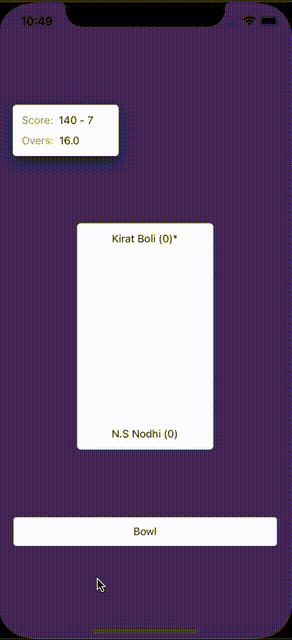

# CricBot
React Native App to simulate a Cricket inning.

The main purpose of creating this project is to showcase how we can follow a `MVVM` `clean architecture` in a React Native Project.

### This Architecture is based on following areas:
- 3 Layer Architecture `(ui | data | domain)`
  - `ui` contains code related to React `components/screens` 
  - `data` contains code related to `(httpclient | localstorage | localdatabase)` 
  - `domain` contains code related to `(viewModel | reducers | actionCreator)` i.e Business Logic
- React Hooks & Custom Hooks for implementing ViewModel `eg: useViewModel`
- TypeScript for defining Generic types through out the project.
- Various `HOCs` & `HOFs` for containing common code and maintaining reusability `eg: withScreen | withPureScreen | withViewModelReducer`

### TODO
- Using Rest APIs for fetching data for app.
- Typescript Refactoring around action creator & reducer HOFs.
- Need to write unit test cases.

# Installation Steps
- `yarn`
- `yarn run ios` or `yarn run android`

# Demo

